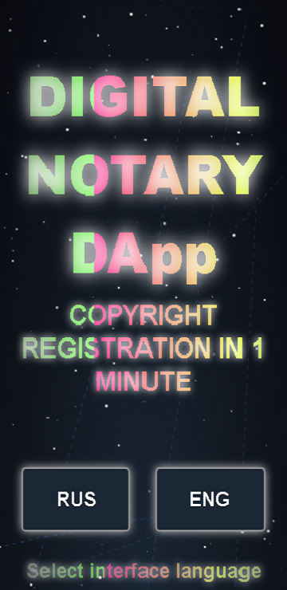
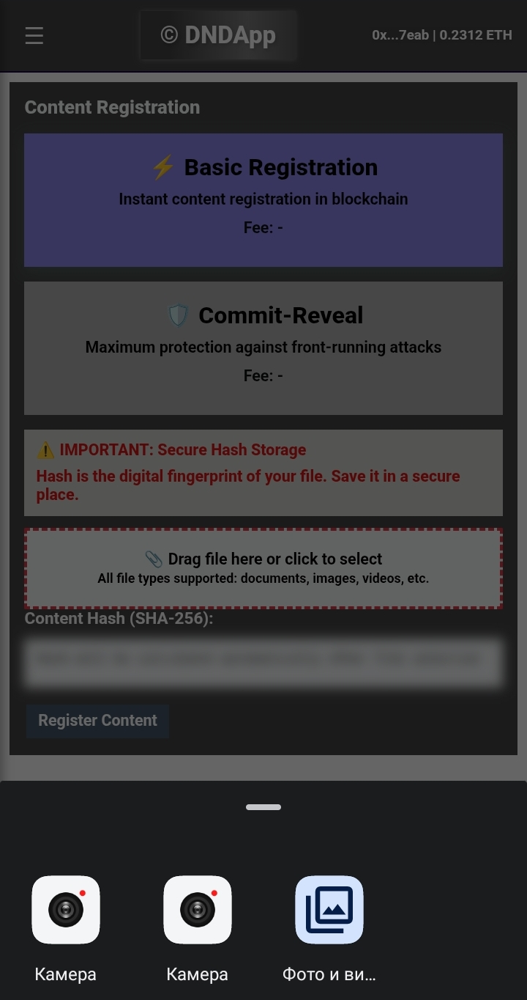
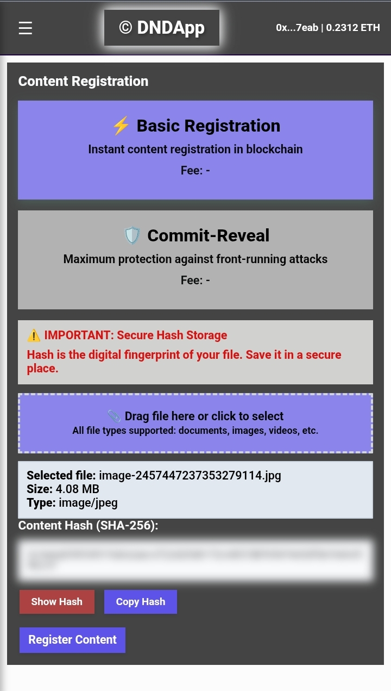
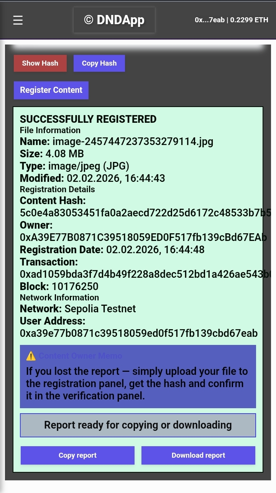

# Digital Notary DApp | On-Chain Proof of Existence & Authorship

A production-ready, mobile-first decentralized application (DApp) that turns any smartphone into a "pocket notary." Instantly create tamper-proof, timestamped proof for any digital content on the Polygon blockchain.

🌐 **Live DApp:** [digitalnotary.online](https://digitalnotary.online)
🔌 **Firefox Extension:** [Available on addons.mozilla.org](https://addons.mozilla.org/ru/firefox/addon/digital-notary/)
📱 **Android App:** In Internal Testing (Google Play)
📜 **Smart Contract (Polygon):** [`0xEa6130eBe3c79fa7f209568030EC78Ac321890C4`](https://polygonscan.com/address/0xEa6130eBe3c79fa7f209568030EC78Ac321890C4)

## 🎯 The Problem & Solution
Proving you were the first to create a digital asset — a photo, video, code, or document — is often slow and legally complex. This DApp solves it by allowing you to create an immutable, on-chain timestamp **in under 60 seconds**, using a secure commit-reveal mechanism to protect priority.

## ✨ Key Features
*   **Any Content, Any Size:** Register photos, videos, documents, audio — directly from your device.
*   **Two Registration Schemes:**
    *   **Direct:** Instant on-chain timestamp.
    *   **Commit-Reveal:** Protection against front-running for sensitive or high-value content.
*   **Privacy-First:** Only the cryptographic hash is stored on-chain; the original content never leaves your device.
*   **Multi-Network Support:** Deployed on Polygon Mainnet, Sepolia, and Amoy testnets (for learning).
*   **Full Verifiability:** Every registration is independently verifiable via Polygonscan.
*   **Mobile-First:** PWA-ready frontend and dedicated Android app in development.

## 🏗️ Architecture & Tech Stack
*   **Smart Contracts:** Solidity, OpenZeppelin Libraries. Deployed on Polygon (EVM).
*   **Frontend:** Vanilla HTML, CSS, JavaScript (Ethers.js). Pure client-side for maximum privacy.
*   **Hosting & Deployment:** Frontend on Netlify (CI/CD), indexed by Google.
*   **Browser Extension:** Firefox WebExtensions API.
*   **Android:** Native app (internal testing stage).

## 📁 Project Structure (Overview)

Digital-Notary-DApp/
├── contracts/ # Solidity smart contracts (see PROOF_OF_ORIGIN for details)
├── frontend/ # HTML/JS/CSS source for the live web app
├── extension/ # Firefox extension source code
└── docs/ # Documentation and Proof of Origin

 **Note on Source Code Access:** The core, production-ready source code for the smart contracts and frontend is **publicly verifiable**. The hashes of all critical snapshots are immutably registered on the Polygon Mainnet. See [PROOF_OF_ORIGIN.md](PROOF_OF_ORIGIN.md) for complete transparency and verification steps. For specific business inquiries, contact is available.

## 🚀 For Developers: Verification & Transparency
This project is built on transparency. All deployment steps and code milestones are documented:
1.  **Contract Addresses** and **deployment transactions** are listed in `PROOF_OF_ORIGIN.md`.
2.  **SHA256 hashes** of major code versions are registered on-chain.
3.  You can verify the live application's functionality against the contract on Polygonscan.

## 🔗 Proof of Origin & First Implementation
A detailed, technical log of the project's creation, including all blockchain transactions and version history, is maintained in:
[**PROOF_OF_ORIGIN.md**](PROOF_OF_ORIGIN.md)

This document serves as a cryptographically-verifiable record of the project's development timeline.

## 📄 License
This project's **documentation and open components** are provided for transparency. For specific licensing of the application code, please contact the author.

## 📸 Application Screenshots

### 1. Mobile Interface

### 2. Content Capture

### 3. Hash Calculation

### 4. Registration Method Selection

### 5. Final Registration Report

---
**Built independently from scratch in 4 months.**
